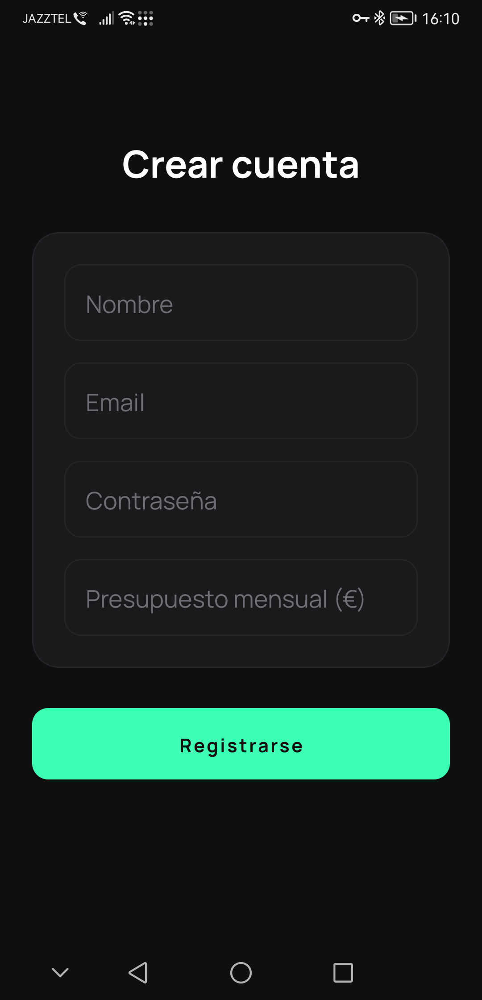
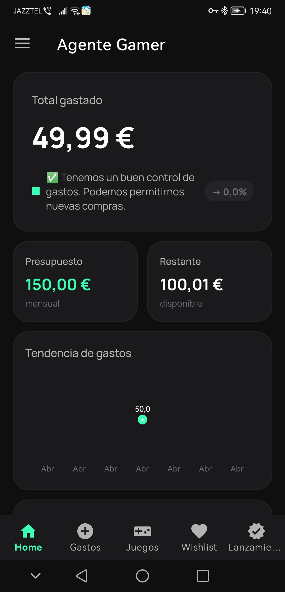
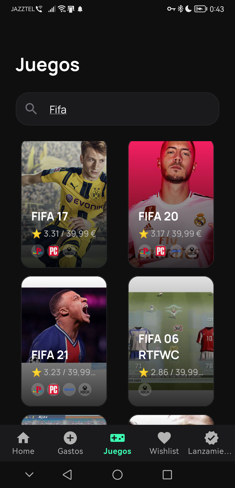
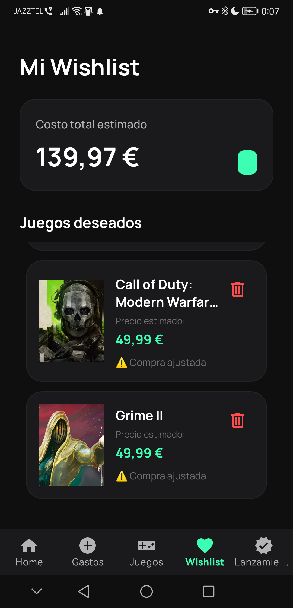
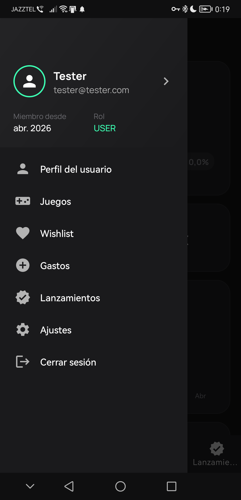

# 🎮 Agente Gamer

> Asistente financiero inteligente para gestionar gastos y compras de videojuegos.

| | |
|---|---|
| **Licencia** | MIT |
| **Versión** | 1.0 |
| **Fecha** | Abril 2026 |
| **Autor** | Javier Lesaca Medina |

---

Agente Gamer es una aplicación Android que ayuda a los jugadores a controlar su presupuesto mensual, registrar gastos en videojuegos y recibir recomendaciones financieras personalizadas. La app sincroniza datos en la nube con Firebase y ofrece una experiencia fluida con preloading de datos durante el arranque.

---

## ✨ Funcionalidades

### Autenticación y Perfil
- Login y registro con **Firebase Auth**
- Perfil de usuario sincronizado en **Firestore**
- Edición de nombre y gestión de presupuesto

### Dashboard Principal
- Resumen financiero: total gastado, presupuesto y restante
- Gráfico de tendencia de gastos (LineChart mensual)
- Gráfico circular de categorías (PieChart)
- Recomendaciones del agente financiero
- Lista de gastos recientes

### Gestión de Gastos
- CRUD completo de gastos con **Room**
- Seguimiento mensual por categoría
- Vista filtrable por fecha

### Catálogo de Juegos
- Integración con **RAWG API** para búsqueda de juegos
- Grid de 2 columnas con paginación
- Detalle de juego en diálogo emergente
- Search con filtros

### Wishlist
- Añadir/eliminar juegos a lista de deseos
- Cálculo de coste total
- Seguimiento de compras

### Lanzamientos
- Juegos próximos con cuenta regresiva
- Precios estimados
- Información de plataforma y género

### Configuración
- Selector de moneda (EUR/USD/GBP)
- Ajuste de presupuesto mensual

---

## 🧱 Arquitectura

Patrón **Clean Architecture** con capas:

```text
com.miapp.agentegamer/
├── data/
│   ├── local/          # Room entities, DAOs, database
│   ├── remote/         # Retrofit API, DTOs
│   ├── repository/     # Implementaciones de repositorio
│   └── worker/         # WorkManager workers
├── domain/
│   ├── model/          # Modelos de dominio
│   └── repository/     # Interfaces de repositorio
├── di/                 # Módulos Hilt
├── ui/
│   ├── splash/         # SplashActivity + preloading
│   ├── auth/           # Login/Register
│   ├── main/           # Dashboard
│   ├── gastos/         # Gestión de gastos
│   ├── games/          # Catálogo de juegos
│   ├── wishlist/       # Lista de deseos
│   ├── lanzamientos/   # Lanzamientos futuros
│   ├── perfil/         # Perfil de usuario
│   ├── ajustes/        # Configuración
│   ├── adapter/        # Adaptadores RecyclerView
│   ├── viewmodel/      # ViewModels + LiveData
│   └── common/         # Utilities y clases base
└── util/               # Helpers (MoneyUtils, etc.)
```

**Patrón MVVM** con ViewModel + LiveData, Repository y Dagger Hilt para inyección de dependencias.

---

## 🛠 Tecnologías

| Categoría | Tecnología |
|-----------|------------|
| **Lenguaje** | Java |
| **Build** | Gradle (Kotlin DSL) |
| **SDK** | minSdk 23, targetSdk 35 |
| **DI** | Dagger Hilt |
| **Auth** | Firebase Auth |
| **DB Cloud** | Firestore |
| **DB Local** | Room |
| **Networking** | Retrofit + Gson |
| **Gráficos** | MPAndroidChart (PieChart, LineChart) |
| **Background** | WorkManager |
| **UI** | Material Components, BottomNavigationView |
| **Splash** | Splash Screen API con preloading |

---

## 🔧 Configuración del entorno

### Requisitos previos
- Android Studio (última versión)
- JDK 17+
- Cuenta en [RAWG.io](https://rawg.io/apidocs) para obtener API key gratuita

### Configuración de RAWG API
La API de juegos requiere una API key gratuita:

1. Registrate en [RAWG.io](https://rawg.io/apidocs)
2. Copiá tu API key
3. Creá el archivo `gradle.properties` en la raíz:

```properties
RAWG_API_KEY=tu_api_key_aqui
```

### Configuración de Firebase (obligatorio)
Sin Firebase la app no funcionará. Seguís estos pasos:

1. Ir a [Firebase Console](https://console.firebase.google.com/)
2. Crear proyecto nuevo
3. Agregar app Android: **Package name**: `com.miapp.agentegamer`
4. Descargar `google-services.json`
5. Copiar el archivo a `app/google-services.json`
6. Habilitar en Firebase Console:
   - **Authentication** → Email/Password
   - **Firestore** → Crear base de datos

### Compilación
```bash
./gradlew assembleDebug
# APK: app/build/outputs/apk/debug/app-debug.apk
```

### Ejecución en Android Studio
1. File → Open → Seleccionar carpeta del proyecto
2. Sincronizar Gradle (Sync Now)
3. Run → Run 'app'

---

## 📷 Capturas de pantalla

<div align="center">
  <table>
    <tr>
      <td></td>
      <td></td>
    </tr>
    <tr>
      <td></td>
      <td></td>
    </tr>
    <tr>
      <td></td>
      <td></td>
    </tr>
  </table>
</div>

---

## 📄 Licencia

MIT License - Proyecto educativo de uso libre.

---

## 📚 Documentación técnica

Ver archivo completo: [doc/Documentacion_PROYECTO_AGENTEGAMER.pdf](doc/Documentacion_PROYECTO_AGENTEGAMER.pdf)

---

## 👨‍💻 Autor

| | |
|---|---|
| **Nombre** | Javier Lesaca Medina |
| **Ciclo** | Desarrollo de Aplicaciones Multiplataforma (DAM) |
| **Centro** | SAFA - San Andrés |
| **Año** | 2025-2026 |
| **Proyecto** | Final de Grado Superior |

---

*Proyecto desarrollado como Trabajo Final de Ciclo Formativo de Grado Superior.*